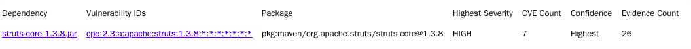

# 针对`jar`包的合规检测

> 问题来源，手里拿到了一批数据，内容的主体是`jar包名+版本`，如`struts-core:1.3.8`，快速定位所有`jar`包(公司所用框架)存在的历史问题。

## 方案

通过`maven`可以获取到具体的`jar`文件，其中`/META-INF/MANIFEST.MF`包含了`Implementation-Vendor-Id`与`Implementation-Version`，切换思路成`jar`来源项目作一个`CPE`检测。可以快速定位到历史问题形成报告。


## 工具

引入开源工具`dependency-check`，自动同步`NVD`信息，并通过构造`cpe`规则输出报告。

```
./dependency-check.sh -s /home/lang/Desktop/struts-core-1.3.8.jar
```



