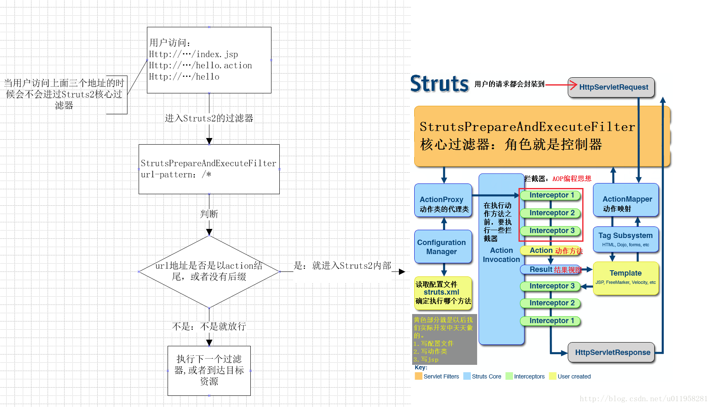

## 什么是java反射
> 类--->对象

java之中，操作的是对象，多个对象可能是由同一个类实例化出来的，那么所谓的`正射`操作就是，先`new`一个对象出来，然后在调用这个对象的各种方法和属性，这儿就产生了一个问题，就是我们在操作的时候忽然想再调用一个对象，也许是不同的类，也可能和先前的对象一样，都是同一个类。那如果只有`正射`的情况下，需要创建的对象都是提前定义好的，如果要创建新的，只能重新硬编码，代码上也就是添加一个`new`的操作，然后重新运行，这明显影响了工作，因为不可能说需要调用一个新对象就重启整个环境。

这儿阐述的问题是什么呢？
1. 倘若一个程序在运行之后，所有需要用到的对象都被提前硬编码`new`好了，也就是不再会调用新的或者未知的对象，那么无需反射，因为所有想要用到的对象都被创建了，就可以直接调用指定对象的方法就行。
2. 倘若你在`code`时什么都不能确定，不能确定要用到哪个对象，不能确定要创建多少个对象，不能确定这个对象是用的哪个类，简单来说，类你写好了，但是你不知道`new`几个，或者是不知道该不该`new`。

###　实际场景
```
public class apple{
    public void sell(){
        System.out.println("price:100");
    }
}

public class orange{
    public void sell(){
        System.out.println("price:200");
    }
}

public class banana{
    public void sell(){
        System.out.println("price:300");
    }
}
```
比如上述三个类，代表了三个水果的卖出的方式(显示价格)，如果用正射的方式，因为不清楚用户想买哪个水果，你就得根据用户输入通过`if....else`来`new`
```
if(fruit.equals('apple')){
    apple apple=new apple();
    apple.sell();
}
else if
(fruit.equals('orange')){
   orangeorange=new orange();
    orange.sell();
}
else if
(fruit.equals('banana')){
   bananabanana=new banana();
    banana.sell();
}
```
如上，每一个对象都得提前硬编码创建或者满足情况创建，这样的形式太麻烦，因为如果是一万种水果呢？
这儿就是反射的用法了:
    1. 类实现一个接口
    2. 根据用户的输入(需求)去`载入相应类`(这儿就是为什么要用到类路径而非类名)
    3. `new`出对象
    4. 调用对象方法
这样就不需要循环嵌套判断条件了

## 反射API
在JDK里面实现了java的反射机制，都在`java.lang.reflct`里。
在反射里需要获取一个类或者调用一个类的方法时(载入类)，提供了三种方法:
第一种，使用 Class.forName 静态方法。当你知道该类的`全路径名`时，你可以使用该方法获取 Class 类对象。
```
Class clz = Class.forName("java.lang.String");
```
第二种，使用 .class 方法。
这种方法只适合在编译前就知道操作的 Class。
```
Class clz = String.class;
```
第三种，使用类对象的 getClass() 方法。
```
String str = new String("Hello");
Class clz = str.getClass();
```
基本都是用的第一种，不过EXP上的利用第三种也挺多的，因为知道对象名。
载入类后就可以动态创建对象了
1. 通过 Class 对象的 newInstance() 方法
2. 通过 Constructor 对象的 newInstance() 方法
通过Class对象只能使用默认的无参数构造，而先使用Class对象获取指定的Constructor对象，再调用Constructor对象的newInstance()创建Class对象对应类的对象则能指定构造方法来创建对象()
# 框架里的反射
以struts2来说，众多类名称(类路径)是放在XML里的，因为要实现如下的映射方法：

  `URL` --> `filter` --> `action` --> `xml(每个action都有对应的处理类)`

# 安全里的反射
1. Ognl表达式注入

在2.3.14.2以后，`SecurityMemberAccess`类中删除了`setAllowStaticMethodAccess`方法，而私有属性`allowStaticMethodAccess`默认为`False`，以前通过`#_memberAccess['allowStaticMethodAccess']=true`实现允许静态方法调用的方式已然成了过去。
反射利用;
```
#m=#_memberAccess.getClass().getDeclaredField('allowStaticMethodAccess')
#m.setAccessible(true)
#m.set(#_memberAccess,true)
```
> 插一句关于setAccessible()的：


2. EL表达式注入：

这个坑后面填，直接挂资料[JBOSS Seam框架远程代码执行漏洞](http://www.voidcn.com/article/p-ohiqbrje-sh.html)

# 参考资料:
[Java反射机制的引入、使用和优缺点](https://blog.csdn.net/Elias94/article/details/80361035)
[白话说java反射](https://www.cnblogs.com/chanshuyi/p/head_first_of_reflection.html)