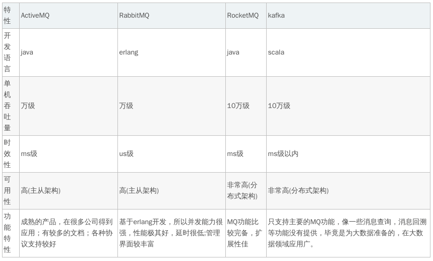

# MQ中间件 -- kafka
* 为什么要用到MQ中间件
* kafka的优劣
## 为什么要用到MQ中间件
> `Message Queuing`消息队列

1. 解耦

传统模式下，一个系统接入到另一个系统中，都是通过代码耦合来解决，因此每多一个新系统接入，就要修改一下代码，在这个基础上，产生了api的概念，对接的系统之间商量出相同的数据格式对接即可，同时还可以采用中间件的模式，也就是主系统将所有的数据都写入到一个消息队列中去，需要消息的系统则自己去消息队列中订阅，就像报刊发布一样。

2. 异步

在不同的服务之间有可能会出现处理相同消息的情况，但是由于服务迭代的问题，消息传递的情况很有可能是`A-B-C`这样的，因此如果`C`想要处理数据就必须要等待`B`先处理完把消息传过来，这无疑是低效的，因此`A`完全可以把消息写入一个中间件中，需要处理相同消息的系统主动来消费从而打到异步运行。

3. 削峰

请求并发过大时候，所有的请求都是直接查询的数据库，很容易导致数据库的连接异常，因此可以将所有的请求都写入消息队列里，然后系统根据数据库的并发限制来拉取请求，以此达到短暂的高峰期积压。

然而消息队列带来的负面影响也是存在的，比如系统可用性的问题，多增加一个服务就是多增加一份风险，如果系统之间都通过消息队列来传输数据，如果消息队列挂了，那么所有的系统都将异常。同时还提高了系统复杂性，因为消费消息就要考虑到一致性问题以及如何保证消息不被重复消费，如何保证消息传输可靠，如何做消息丢失的召回。

## 消息队列模式
现在的消息队列主要应用有三种模式：
1. `pub/sub模式`，也就是包含了`Topic(主题)`，`Publisher(发布者)`，`Subscriber(订阅者)`，以`topic`为节点，可以有多个`发布者`，同时也可以有多个`订阅者`
2. `p2p模式`，包含`发送者`，`消息队列`和`接收者`，一个消息只有一个消费者。
3. `push/pull模式`，也就是现在常用的模式，服务端主动推送消息/客户端主动发起消息请求。

## kafka
`MQ中间件`有多种，比如`ActiveMQ`，`RabbitMQ`，`kafka`等，展示一个性能对比表



就以`kafka`为例子，看下`kafka`的架构。


一个`kafka`节点就是一个`broker`，多个组成一个`kafka`集群，`Topic`是消息归类的标识，任何一条消息都要指定`topic`，`producer`和`consumer`是从`broker`中`push/pull`的数据，一条消息可以发送到多个不同的`ConsumerGroup`，但是一个`group`中只有一个`Consumer`可以消费该条信息，而一个`topic`可以分成多个`partition`，其中每个`partition`内部有序。

具体表现是什么呢？
1. 相同`group`的不同`consumer`获取的数据加起来是一个`topic`发布的数据
2. 如果`consumer`数量大于`partition`的话，就会有`consumer`收不到信息

一个`producer`发布数据
```
kafka-console-producer.sh --broker-list kafka.domain.com:9092 --topic TOPIC_NAME
```
而一个`consumer`消费数据
```
kafka-console-consumer.sh --bootstrap-server kafka.domain.com:9092 --topic TOPIC_NAME --consumer-property group.id=kafka
```

# 实时分析器 -- flink
> 这段时间一直在做这个，坑点太多，不如简明扼要

## 可以处理的数据
1. `DataStream`
2. `Table&sql`

层级结构上如图：


越上层越慢，但是封装的不错，因此也就越简单。但是坑点也在，就是`SQL`是在`流`的基础上封装的，因此表是实时表，因此就算你用了虚表，那么原来的字段也还是没有的。
> 最常见的问题就是`SQL`中的`group by`如果后面没有分组的字段，那么这个字段就会丢失无法`select`。

## 窗口
最常用的聚合，坑点在于得自己处理`窗口数据`，而且更大的坑点在于`时间窗口`默认是`ProcessingTime`，因此需要手动设置`EventTime`的标志位，这就需要用到`waterMark`
```
env.setStreamTimeCharacteristic(TimeCharacteristic.EventTime);
```
处理时间
```
        DataStream<Tuple5<Long,String,String,String,String>> waterMarkStream = dataStream.assignTimestampsAndWatermarks(new AssignerWithPeriodicWatermarks<T>() {
            Long currentMaxTimestamp = 0L;
            //允许最大乱序时间:10s
            final Long maxOutofOrderness = 10000L;
            @Nullable
            @Override
            public Watermark getCurrentWatermark() {
                return new Watermark(currentMaxTimestamp-maxOutofOrderness);
            }
            @Override
            public long extractTimestamp(element, long previousElementTimestamp) {
                long timestamp = element.f0;
                currentMaxTimestamp = Math.max(timestamp,currentMaxTimestamp);
                return timestamp;
            }
        });
```
提前聚合的`keyby()`，这个个人感觉并不实用，但是涉及到`window`和`No-Key-Window`，最常见的区别在于
```
window()和windowAll()
```
一个是先分组再聚合，另一个是全量聚合。
## `map()`和`flatMap()`
`map()`能做的`flatMap()`都可以，因此用`flatMap()`就行了，作用就是把基础的`DataStream`再清洗一遍。
## 执行和输出
输出流的信息的话只需要选取要输出的`流`后面加`print`，如`dataStream.print()`，而整个实时分析器的触发则是在`env.excute()`

## 作用
如名实时分析处理消息，不同于`hadoop`这样的定时全量分析，能够做到实时分析。具体案例就是实时推荐。
比如在淘宝搜索食品，此时的推荐商品是电器，如果是全量分析，很有可能在第二天才会推荐食品，而如果是实时分析，则会在第一时间把推荐换成食品。

能处理流就尽量处理流，不要搞`Table&Sql`，虽然更简单，但是坑也多。

# 结语
刚接触不久，坑很多，还在填。

# 参考资料
* [flink api](http://flink.iteblog.com/index.html)