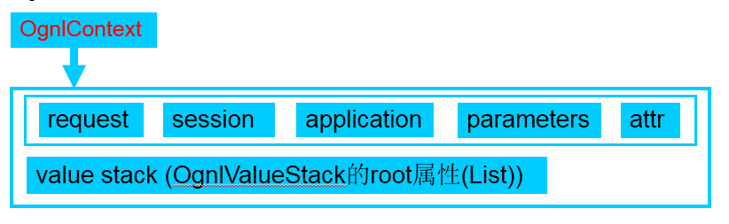
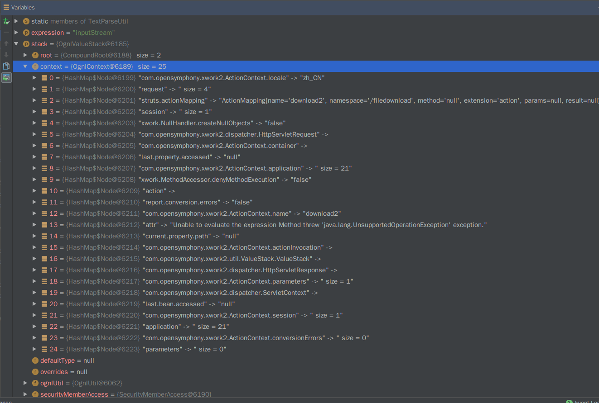
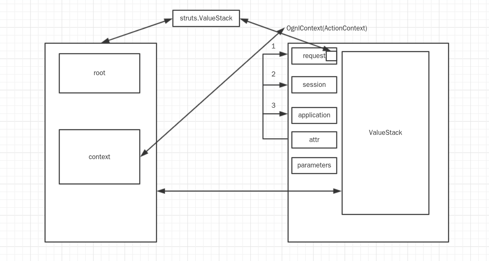
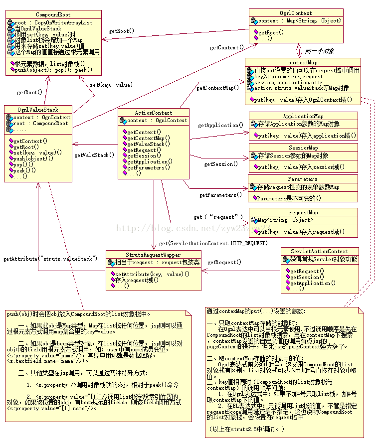

## Ognl
>对象图导航语言

这是一个非常抽象的东西，我们形象一点说(不够严谨)，比如图书馆找书。

1. 我们有一个书的图书码(ongl表达式)，根据这个图书码，便能在图书馆(OgnlContext)里找到想要的书。
2. 我们在图书馆(OgnlContext)里借书的流程(ongl表达式)

图书馆这一个东西里包含的东西有很多，如书籍，工作人员，场馆规则，这些都是图书馆的本身属性。

`OgnlContext`本质上就是一个`Map`，`ongl表达式`就是根据特定的语法，指向了这个`Map`中具体的某个东西，它就是一个或多个`导航链`，而单个`链`可能是下述的某一个：
|链|
| - |
|属性名称|
|方法调用|
|数组元素|
`链`与`链`之间用`.`或是直接连接组成`导航链`，而多个`导航链`用`,`连接组成一个具体的`ognl表达式`，例如
```
name.toCharArray()[0]
```
* name是属性名
* toCharArray()是方法调用
* [0]提取第一个值

## 对于Ognl本身来说的使用
>说起使用实际上是脱离不开真实环境的，因为真实环境中为了安全性的考虑，实际上限制了表达式的使用，并非是肆无忌惮的，所以先简单说下Ognl本身的使用。

1. 常量: 其中包含了字符串，字符，数字
2. 属性引用：如user.name
3. 变量引用：#name
4. 静态变量的访问：@user@name
5. 静态方法的调用：@user@changeName()
6. 构造函数的调用：new java.util,ArrayList();

参考`Ognl语言指南`

## struts2与ognl

### ActionContext，OgnlContext，ValueStack
说到`ognl`怎么都无法避开`struts2`，如上所述`ognl`是针对一个`OgnlContext`的`导航`，那么`struts2`就必然要提供这么一个`Map`出来，也就是`ActionContext`。

`struts2`针对一个请求，都会创建`ActionContext`，`ValueStack`，`action`。`action`会放入`ValueStack`。
`ActionContext`就是`OgnlContext`，`OgnlContext`是一个概念。

看下实际的情况：

对于`struts2`来说，最外层的东西是`OgnlValueStack`，然后`OgnlValueStack`的`context`就是`OgnlContext`，这个就是`ognl表达式`执行的`上下文(Map)`，给的名字是`OgnlContext`，其实他就是`ognl`需要的`OgnlContext`，而这个`OgnlContext`中有一个`ValueStack`，而这个`ValueStack`的`context`就是`ActionContext`，同时这也是`request`域中的`struts.ValueStack`属性
是不是感觉很乱，画个图就知道了：
> 其中request和parameters的取值必须用#


这是简化版，我挂个详细版：

## struts2的Ognl
struts2中也有`容器`的概念，为了处理每个对象的关系，一样有反转控制和依赖注入。这是框架内部的一个实现，和业务本身没有关系。
1. 容器是一个全局且唯一的编程元素
2. 容器应该最先小限度的介入业务逻辑
3. 提供一系列的接口或者方法获取容器内的对象

对于`Struts2`来说，上下文就是`容器`，同时对于`ognl`来说，上下文就是`OgnlContext`，这就是一个东西从不同维度的叫法。

## 安全机制
struts2自己的安全机制上，现在已经默认禁止了`静态方法调用`，还针对`方法调用`施加了黑名单，但是任意代码执行的实现又绕不开这两个，因此`struts2`的RCE漏洞在挖掘的难度上远远低于利用。
那么实际利用的核心思路就是
1. `重获静态方法调用`
2. `绕过(清除)黑名单`

`ognl`的执行需要一个`OgnlContext`，当前的`OgnlContext`的内部属性已经完全确定了，禁止`静态方法`调用，黑名单都已经被加载，那就要想办法清除，也就是修改`上下文`的一个属性。
首先是`重获静态方法调用`，以前是通过内部方法`setAllowStaticMethodAccess`，后来被删了，现在就换一种方式就是`setMemberAccess`，但是这个方法在黑名单里，就要先去清除黑名单，要想清除，首先得去指定到这个属性，`com.opensymphony.xwork2.ognl.OgnlUtil`下的`getExcludedClasses()`方法和`getExcludedPackageNames()`何以获取到这个属性集合，然后`clear()`便是，但是我们要想调用方法就得先有`OgnUtil`这个对象，那就通过`getInstance()`方法实例化出来，但是这个方法又是`com.opensymphony.xwork2.ActionContext.container`的，因此得先获取到这个类的对象，而`OgnlContext`中是有这个对象的，只不过在`ValueStack`里，因此就是`#context['com.opensymphony.xwork2.ActionContext.container']`，这儿的`com.opensymphony.xwork2.ActionContext.container`是一个`key`，而不是具体路径，不过2.3.34以后没有`#context`这个`key`了，因此还是`#request['struts.valueStack']`靠谱。
> getInstance()这是有限制的，实例得是容器托管的，具体信息可以看一下[Struts2源码学习](https://www.cnblogs.com/forwrader/p/7659708.html)，不过在深入就是开发的知识了。

3.34之前版本：
```
    public static final String CONTEXT_CONTEXT_KEY = "context";
    public static final String ROOT_CONTEXT_KEY = "root";
    public static final String THIS_CONTEXT_KEY = "this";
```
这个就是#context
```
        RESERVED_KEYS.put(CONTEXT_CONTEXT_KEY, null);
        RESERVED_KEYS.put(ROOT_CONTEXT_KEY, null);
        RESERVED_KEYS.put(THIS_CONTEXT_KEY, null);
```
再看：
```
        if (RESERVED_KEYS.containsKey(key)) {
            if (key.equals(OgnlContext.THIS_CONTEXT_KEY)) {
                result = getCurrentObject();
            } else {
                if (key.equals(OgnlContext.ROOT_CONTEXT_KEY)) {
                    result = getRoot();
                } else {
                    if (key.equals(OgnlContext.CONTEXT_CONTEXT_KEY)) {
                        result = this;
                    } else {
                        ......
```
#root是获取根属性,#context是OgnlContext,#this是当前“调用者”对应的实例。

#context->this->OgnlContext->ActionContext.getContext() 

Ognl的表达式基本语法：可以用#key的形式访问OGNL Context对象中的各个key对应的对象，并可以采用点(.)操作符进行多级导航调用对象的属性和方法

excludedClasses有禁用列表。excludedPackageNamePatterns同样有禁用列表。`isClassExcluded`判断了目标类和超类是否相等或者声明类和超类是否相同，相等的话返回真，因此让要执行的方法的类不要出现在其中

### 记录流程
> 3.34流程
ognl表达式会进入到`translateVariables`中，然后作为`parsedValue`的值进入`stack.findValue`，中间过程看一下调用栈信息，没什么关键点，跳过直接到`OgnlValueStack(352)`的`getValue`中，再次跳过两次调用栈信息，进入到`OgnlUtil(393)`的`final T exec = task.execute(tree);`，从这儿`F7`会惊讶的发现作为`tree`进入到了`OgnlUtil(370)`的`getValue`中，再跟进，进入`Ognl(470)`的`getValue()`，`SimpleNode(223)`的`getValue`中，这儿就是关键部分了，在函数的`false`中有个`evaluateGetValueBody`，会将`Ognl表达式`一点点拆分开来，跳过调用栈，进入`ASTChain`的`getValueBody`，注意此刻的`this`，在跟进的途中进入到`getIndexedPropertyType`中，其中令人注意的是一个`if`判断`isIndexedAccess`，先放着，而其中执行的关键部分在`ASTProperty(116)`的`Object result = OgnlRuntime.getProperty(context, source, property);`，这个环节里有好多段是用来设置`CURRENT_PROPERTY_PATH`的，在`ReflectionContextState`中的`context.put(CURRENT_PROPERTY_PATH, currentPath);`来确定。
再确定一个`StrutsRequestWrapper(84)`中的
```
        ActionContext ctx = ActionContext.getContext();
        Object attribute = super.getAttribute(key);
```
其中`attribute`就出结果了，其中在寻找`strtus.valueStack`很有意思，经过了多层寻找，最后提取到了key对应的信息，主要集中在`SimpleNode.java(197)`这儿，循环查找key。

> Ognl的运行需要有OgnlContext，struts2提供的OgnlContext就是ValueStack

去探寻提取的过程：
3.36 
OgnlRuntime(2422)进入到异常
```
return accessor.getProperty(context, source, name); -->ObjectPropertyAccessor(147) -->ObjectPropertyAccessor(60) -->OgnlRuntime(1456) -->SecurityMemberAccess(82)
```
其中OgnlRuntime(1450)经过一个**getGetMethod()**会产生**getContext()**，method是`com.opensymphony.xwork2.ognl.OgnlVauleStack.getContext()`
但是在SecurityMemberAccess(161)中会有一个循环判断，是否为`struts-default.xml`中设置的开头，因此在此被黑名单检测，进入到`Error`中，导致payload失败。


