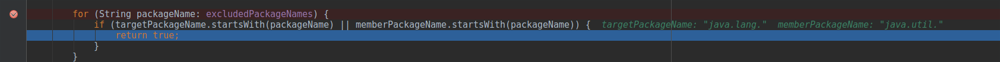
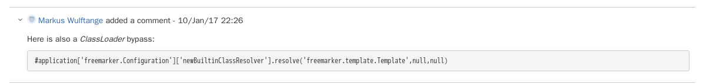
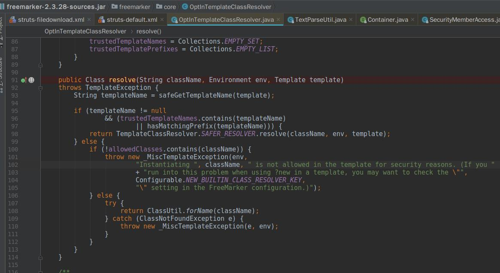

## The Apache Struts 2 doesn’t provide any security mechanism - it is just a pure web framework. 
> 对不起，我笑了

`struts2`提供了一个内部安全机制用来阻止对`particular classess(特定类)`和`java packages`的访问，而且这是一个针对`OGNL`的机制，因此会影响到整个框架，如参数，jsp文件里的表达式等等。
说白了就是一个黑名单，在`struts-default.xml`中定义：
* `struts.excludedClasses`  禁止访问的类
* `struts.excludedPackageNamePatterns`  正则形式的包黑名单，但是现在都被注释了
* `struts.excludedPackageNames`  禁止访问的包名，就是简单的字符串比对，一般是`startWith`和`equals`，不过基本是前一个

``` 2.3.36
    <constant name="struts.excludedClasses"
              value="
                java.lang.Object,
                java.lang.Runtime,
                java.lang.System,
                java.lang.Class,
                java.lang.ClassLoader,
                java.lang.Shutdown,
                java.lang.ProcessBuilder,
                com.opensymphony.xwork2.ActionContext" />
    <constant name="struts.excludedPackageNames"
              value="
                ognl.,
                javax.,
                freemarker.core.,
                freemarker.template.,
                freemarker.ext.rhino.,
                sun.reflect.,
                javassist.,
                com.opensymphony.xwork2.ognl.,
                com.opensymphony.xwork2.security.,
                com.opensymphony.xwork2.util." />
```
倘若`ongl表达式中`出现了`new MyBean()`这样的构造函数，就会被归类到`java.lang.Class`中，以如下为例子：
```
${new java.util.ArrayList()}
```


当然这些黑名单可以在`struts.xml`中重新定义，不过官方并不建议这样做

## 针对静态方法调用的防御
从表达式访问`静态方法`的方法直接被`disable`了，官方还给了声明[ww-4348](https://issues.apache.org/jira/browse/WW-4348)，从`2.3.16`开始的
```
<constant name="struts.ognl.allowStaticMethodAccess" value="true" />
```
除非又把这东西给开了，否则默认是`false`的，不过现在`ognl注入`类型的漏洞还是在不断的想法突破这个限制，获取到`调用静态方法`的能力。
> 讨论里面有一条十分的让我在意。

`#application['freemarker.Configuration']['newBuiltinClassResolver'].resolve('freemarker.template.Template',null,null)`

## 严格方法调用
这个是在`2.5`系引入的功能，允许`动态方法`使用`!`来控制可以访问的方法，没看出什么意义，先记着。

## 回顾
回顾到上述的那个评论，调试了一会，改进后的`payload`大概如下：
```
#application['freemarker.Configuration'].newBuiltinClassResolver
```
但是这儿通过`if (isPackageExcluded(targetClass.getPackage(), memberClass.getPackage())) `后就进了黑名单了
```
freemarker.core.,
freemarker.template.,
```
实际仔细看看也是，想要调用的`resolve`方法确实在黑名单里。


`3.34`的黑名单：
```
    <constant name="struts.excludedClasses"
              value="
                java.lang.Object,
                java.lang.Runtime,
                java.lang.System,
                java.lang.Class,
                java.lang.ClassLoader,
                java.lang.Shutdown,
                java.lang.ProcessBuilder,
                ognl.OgnlContext,
                ognl.ClassResolver,
                ognl.TypeConverter,
                ognl.MemberAccess,
                ognl.DefaultMemberAccess,
                com.opensymphony.xwork2.ognl.SecurityMemberAccess,
                com.opensymphony.xwork2.ActionContext" />
    <constant name="struts.excludedPackageNames" value="java.lang.,ognl,javax" />
```
和`3.34`相比，`3.36`明显严格了很多，比如以前获取`context`的方式来源于
* `com.opensymphony.xwork2.ActionContext#getContext`

进了黑名单，然后就是`getInstance`来源于
* `com.opensymphony.xwork2.inject.ContainerImpl#getInstance`

即使在`3.36`中也在黑名单外，然而非常关键的一个黑名单的操作`getExcludedPackageNames()`这些是在黑名单里面的
* `com.opensymphony.xwork2.ognl.OgnlUtil#getExcludedPackageNames`

因此黑名单的绕过这儿也一并出现了问题。这就导致无法使用`setMemberAccess`，因为来源是
* `ognl.OgnlContext#setMemberAccess`

`ognl表达式`的执行需要上下文环境，而当前的上下文中没有静态能力，而获取静态能力就需要`set`，而`set`就需要先绕过`blacklist`，目前绕过黑名单的方式都写在`com.opensymphony.xwork2.ognl.OgnlUtil`中，就算能清除`blacklist`，还需要获取到当前的上下文环境，当前的`payload`这些也在黑名单里。
* `com.opensymphony.xwork2.ActionContext#getContext`
* `com.opensymphony.xwork2.ognl.OgnlUtil#getExcludedPackageNames`

> 如何获得ActionContext：
在自定义的拦截器中：使用ActionInvocation.getInvocationContext()或者使用ActionContext.getContext()。第一个是`com.opensymphony.xwork2.DefaultActionInvocation`